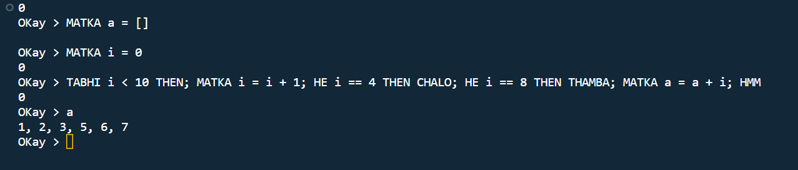

# OKay - A toy based Programming language

OKay is a simple, toy-based programming language designed to introduce beginners to the world of programming. 

OKay is written using Python, a simple language that can be understood by beginners.
## Features
OKay has the following features:

1. **Simple Syntax**: OKay uses a straightforward syntax that is easy to understand and follow. It is designed to resemble natural language, making it beginner-friendly.

2. **Basic Data Types**: OKay supports basic data types such as numbers, strings, and booleans. It also provides basic operations and functions for manipulating these data types.

3. **Variables**: You can declare variables in OKay and assign values to them. Variables can be used to store and manipulate data throughout your program.

4. **Conditional Statements**: OKay supports if-else statements for conditional branching. You can perform different actions based on certain conditions.

5. **Loops**: OKay provides while loops for iterative execution. You can repeat a block of code until a specific condition is met.
## Getting Started

To get started with OKay, follow these steps:

1. **Installation**: OKay requires Python to be installed on your machine. You can download and install the latest version of Python from the official website (https://www.python.org).

2. **Download OKay**: Download the OKay interpreter from the official GitHub repository (https://github.com/Longju000/OKay-Language).

3. **Write Your First Program**: Create a new file with the `.ok` extension (e.g., `test.ok`). Open the file in a text editor and start writing your OKay code. A simple "Hello, World!" program in OKay looks like this:

## Usage
You can either run the code with the help of the shell or by creating a ```.ok``` extension

To PRINT = DEKHO() :
If we want to print something, then we have a user defined function named
as ```DEKHO()```
Dekho is as same as all functionality like the ```print,printf``` etc,.
```
OKay > DEKHO("This is the OKay language!!);
```
**Run**

RUN = KHELO()
This function will run your file in the terminal. Create a text file with the
extension ```test.ok``` After that run your file in your terminal using the KHELO built-in
function
```
OKay > KHELO("test.ok")
```
**Output**

```
This is the OKay language!!
```


## Documentation
Explanation of the code line by line. Follow the link.
[Documentation for code](https://docs.google.com/document/d/1VHaIR6dbcSMAJUoBOlJmaqaen2y4LOPz/edit?usp=sharing&ouid=112497724447928782259&rtpof=true&sd=true)


## Screenshots

Syntax for the OKay language
//TO PRINT = DEKHO()


//To declare a variable, 
VAR = MATKA()
To declare ---> string, char, int, float,Number or int, string, Can concatenate strings, charPI


INPUT = BOLO()


//IF -ELSE = HE (CONDITION) – TE(CONDITION)


FOR = TABTAK()


WHILE = TABHI()


END =HMM


RETURN = DEDO()


CONTINUE =CHALO() also use of TO, THEN, ELIF is shown here.


CLEAR SCREEN = POCHO()
THIS WILL CLEAR YOUR TERMINAL.
RUN = KHELO()

This function will run your file in the terminal. Create a text file with the extension .ok
After that run your file in your terminal using the KHELO built-in function.


BREAK = THAMBA also use of LIST functions is shown here.

FUNCTION = DADA()


## Roadmap

- Add object support in the near future

- Add more integrations and built in functions.


## Contributing

Contributions are always welcome!

See `contributing.md` for ways to get started.

Please adhere to this project's `code of conduct`.


## Acknowledgements

 - [ChatGPT](https://chat.openai.com/)
 - [Bart](https://bard.google.com/)
 - Github Co-Pilot
 - [Writing An Interpreter In Go](https://interpreterbook.com/)
 - [CodePulse](https://youtube.com/playlist?list=PLZQftyCk7_SdoVexSmwy_tBgs7P0b97y)
 - [BhaiLang](https://github.com/DulLabs/bhai-lang)
 - [Crafting Interpreter](https://craftinginterpreters.com/)

 And also all the blogs, articles, that are related to building a programming language.


